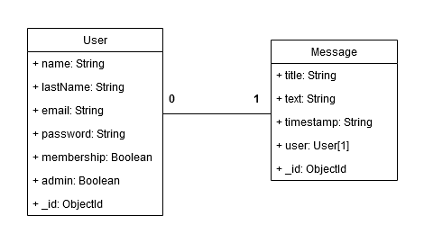

# Members-Only


Members Only is an exclusive clubhouse where anyone can come and see the messages but only logged-in users can write new messages. To see who created the message and when users have to get the membership by entering a SECRET code. Users can check their membership status in the navigation menu. There's also an admin who can see all the messages with author, date, and time, and can also delete the messages.

I created this project mainly to practice full-stack development with a focus on authentication and user permissions management.

# Features
- Register and create new users in the data base with MongoDb and Mongoose.
- Securing password with bcryptjs.
- Log in users and authentication with passportjs.
- Membership and Admin with enter a secret code.
- Schema validation with Mongoose.
- Server app create with Express js using MVC design pattern.
- Front end created using ejs view engine.

# Technologies Used
- Node js.
- Javascript.
- Express.
- Ejs.
- MongoDB.
- Mongoose.
- Passportjs.
- Bcryptjs.

# DB Diagram


# Run It Locally

## Prerequisites
 - Nodejs version `v18.16.1` or above.
 - You'll need a running MongoDB instance, either locally or deployed in the cloud. You can deploy one easily following this [documentation](https://www.mongodb.com/docs/atlas/getting-started/).

 ```bash
# Clone this repository
$ git clone https://github.com/LucioFurnari/Members-Only.git

# Go into the repository
$ cd Members-Only
```

### Setting up environment variables

- Rename `.env.example` file to `.env`.
- Populate `.env` with the following environment variables:
  - `PORT`: Your node server will run on this port. Default is 3001. If you want to use a different port, make sure to update it in client's `.env` file.
  - `MONGODB_URL`: Update the placeholders with your running MongoDB instance's data.
  - `MEMBER_CODE`: The secret code you want user to enter to get membership.
- Update the environment variables and save the file.

### Starting the application

```bash
# Go to server directory
$ cd Members-Only

# Install dependencies
$ npm install

# Start app
$ npm run start
```
<!-- harrow99@gmail.com
123 -->

<!-- // Add validation and sanitization to message creation.
// Implement remove message for ADMIN user. -->